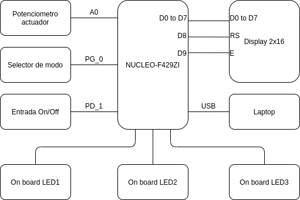

# Introducción a los sistemas embebidos

Universidad de Buenos Aires

Gonzalo Nahuel Vaca

## Introducción

Este proyecto es una simulación de un sistema físico que se comporta como una oscilación amortiguada.
Es completamente configurable.

A partir de la ecuación de una oscilación amortiguada en dominio Z se genera una clase que computa cada paso de la simulación.
Se utilizan interrupciones de temporizador para mantener el paso.

Los valores calculados se muestran en un display LCD, por terminal serie y finalmente se visualiza con el LED verde de la placa *NUCLEO-F429ZI*.

Hay una entrada analógica para conectar un controlador o un potenciómetro que lo simule. Además, se puede seleccionar un modo de entrada del tipo escalón. Esto tiene la finalidad de estudiar la respuesta y calcular un posible sistema de control.

Es una herramienta útil para practicar métodos de sintonización de *PID* o estimaciones de modelos de planta.

## Demostración

https://youtu.be/82JkSxRnMWo

## Diagrama en bloques

## Licencia (License)
Apache 2.0 license.

