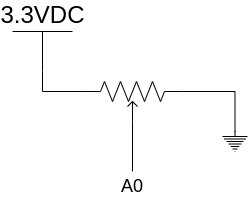
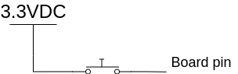
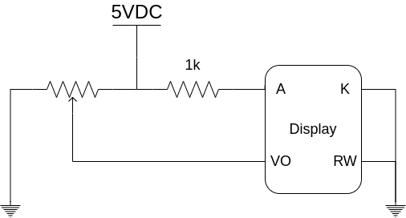

# Introducción a los sistemas embebidos

Universidad de Buenos Aires

Gonzalo Nahuel Vaca

## Introducción

Este proyecto es una simulación de un sistema físico que se comporta como una oscilación amortiguada.
Es completamente configurable.

A partir de la ecuación de una oscilación amortiguada en dominio Z se genera una clase que computa cada paso de la simulación.
Se utilizan interrupciones de temporizador para mantener el paso.

Los valores calculados se muestran en un display LCD, por terminal serie y finalmente se visualiza con el LED verde de la placa *NUCLEO-F429ZI*.

Hay una entrada analógica para conectar un controlador o un potenciómetro que lo simule. Además, se puede seleccionar un modo de entrada del tipo escalón. Esto tiene la finalidad de estudiar la respuesta y calcular un posible sistema de control.

Es una herramienta útil para practicar métodos de sintonización de *PID* o estimaciones de modelos de planta.

## Requisitos

* Mbed Studio
* 1 - cable USB
* 1 - display LCD 2x16
* 1 - placa NUCLEO-F429ZI
* 2 - pulsadores
* 1 - fuente 5VDC

## Demostración

https://youtu.be/82JkSxRnMWo

## Diagrama en bloques

## Conexionado

En esta sección se especifica como realizar las conexiones de los distintos módulos que figuran en el diagrama en bloques.

### On board LEDs

Los LEDs *on board* se encuentran listos para ser usados y no requiere ninguna acción adicional por parte del usuario.

### Potenciometro actuador

La entrada **A0** admite valores que excursionen entre 0V y 3.3V.
Esto se puede lograr con un potenciometro conectado según se moestra en la siguiente figura:

### Selector de modo y Entrada On/Off

Estos módulos deben proporcionar una señal digital de 0V a 3.3V.
Para lograrlo se puede utilizar un pulsador touch como se muestra en la siguiente figura:

### Ordenador o laptop

La conexión se realiza con el cable **USB**.

### Display 2x16

Además de realizar las conexiones lógicas según el diagrama de bloques, se deben conectar los siguientes pines:

## Licencia (License)
[Apache 2.0 license](http://www.apache.org/licenses/LICENSE-2.0).

